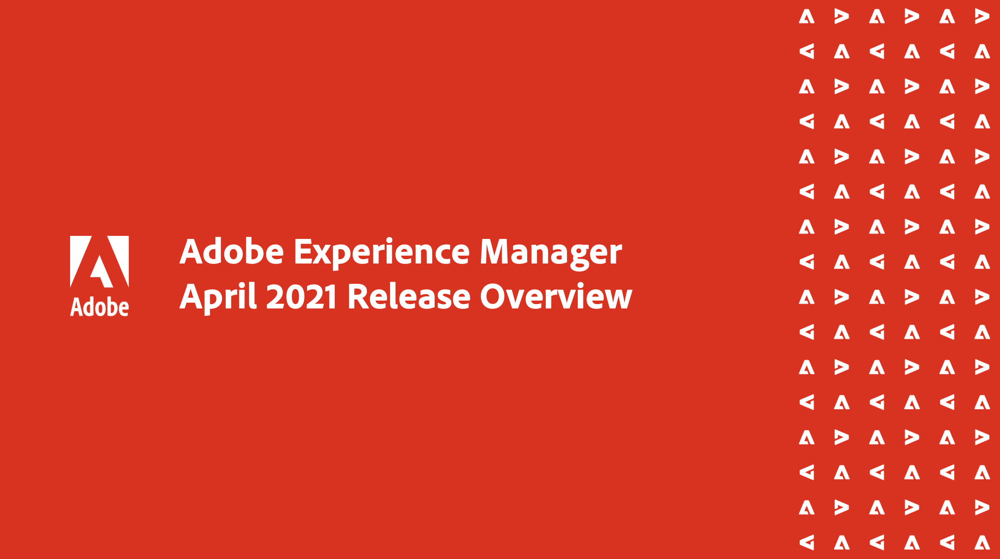

# Adobe Experience Manager as a Cloud Service Release Updates

Get a quick overview of the latest features on Adobe Experience Manager as a Cloud Service. These are short, roughly 10 minutes videos delivered by the AEM product team that share highlights of the latest release.

## Current Release

<table>
<tr>
  <td>
    
    

      <a href="./2022/2022-3-0.md">
        <strong>March 2022 Release, 2022.3.0</strong>
         
        <em>Release Date:  March 31, 2022 </em>
      </a>
    

    

    <em>
      <a href="https://experienceleague.adobe.com/docs/experience-manager-cloud-service/content/release-notes/release-notes/release-notes-current.html">March Release Notes</a>
    </em> 
    

  </td>
</table>

## 2022 Releases

<table>
<tr>
  <td>
    
    

      <a href="./2022/2022-2-0.md">
        <strong>February 2022 Release</strong>
         
 <!--
        <em>Release Date: Februrary 1, 2022 </em>
      </a>
    

    

    <em>
      <a href="https://experienceleague.adobe.com/docs/experience-manager-cloud-service/content/release-notes/release-notes/2022/release-notes-2022-1-0.html">February Release Notes</a>
    </em> 
--->
    

  </td>
  <td>
    
    

      <a href="./2022/2022-1-0.md">
        <strong>January 2022 Release, 2022.1.0</strong>
         
        <em>Release Date:  February 3, 2022 </em>
      </a>
    

    

    <em>
      <a href="https://experienceleague.adobe.com/docs/experience-manager-cloud-service/content/release-notes/release-notes/2022/release-notes-2022-1-0.html">January Release Notes</a>
    </em>  
    

  </td>
</tr>
</table>

>[!TIP]
>
>**See the navigation on the left for recordings for releases from prior years.
